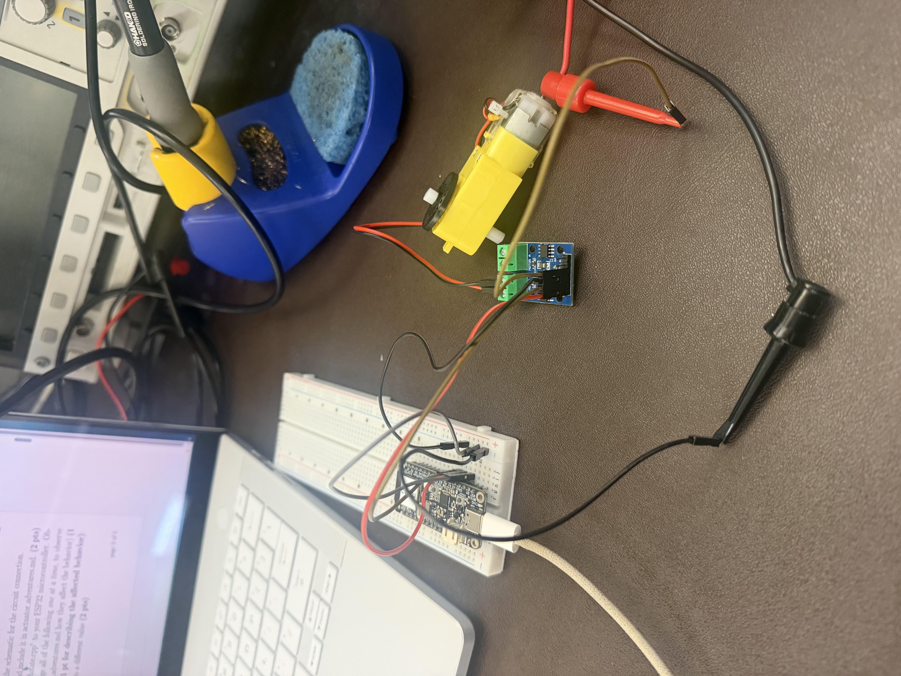
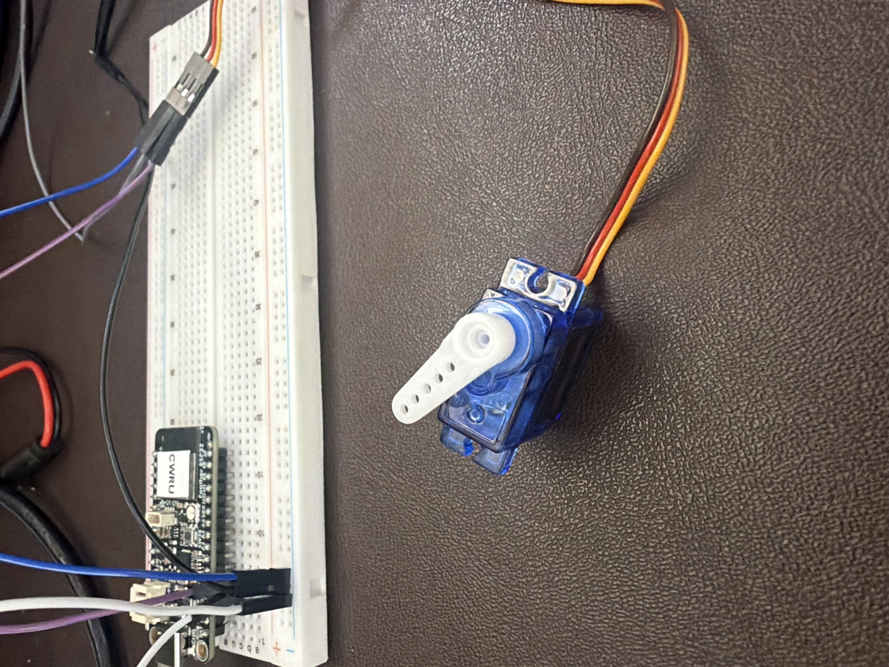

George Guaman

## ECSE 395 Lab 4 - Actuator Adventures

This is my third assignment working with the ESP32. The goal of this lab is to learn how to connect and control actuators using the ESP32. In this lab, I worked with a TT motor and a servo motor. I tested different motor and servo parameters and observed how changing them affected the behavior of the actuators.
### Steps I took
1. I created a new markdown file *actuator_adventure.md* and updated it throughout the lab
2. I opened the Lab 4 folder from my GitHub repo in PlatformIO using VS Code on Windows to build and upload code to the ESP32
3. I built the circuit for the TT motor, connecting and setting up the benchtop power supply to 3V and 0.15A. 
4. I built and uploaded TT Motor.cpp to the ESP32 using a USB-C cable connected to it and my laptop. I made sure to comment any other files I wasn't testing at the moment and repeated this for all uploads/testing.
5. I changed and swapped the values of analogWrite(), and changed value of delay. I observed and recorded these behaviors in this file.
6. I then completed TT Motor Rotate.cpp then built and uploaded it to the ESP32.
7. I recorded a video of it where it rotated clockwise for 5 seconds, stopped for 2 seconds, rotated counterclockwise for 5 seconds, and stopped for 2 second and the repeated this.  
8. I then created and wrote TT Motor EC.cpp and then built and uploaded it.
9. I recorded a video of it where it sped up and slowed down in a loop.
10. I then took apart the circuit and built the circuit for the servo motor. 
11. I connected and setup the benchtop power supply to 5V and 0.75A.
12. I uploaded the Servo Motor.cpp to the ESP32 and observed the servo rotating from 0-180 degrees and the from 180-0 degrees.
13. I then changed the values of minPulseWidth, maxPulseWidth, setPeriodHertz, rotation range, and delay, and recorded their behaviors in this file.
14. I then completed Servo Motor Random.cpp, built and uploaded it to the ESP32.
15. I recorded a video of it where it moved to random angles from 0-180 with random delays.
16. I then created and wrote Servo Motor EC.cpp, then I built and uploaded it to the ESP32.
17. I recorded a video of it where it gradually increases speed and then decreases speed midway from (0-180) and then repeats the same behavior from (180-0), repeating this sequence.
18. I then pushed and committed all these changes to GitHub

All of the Lab 4 files are located in the Lab 4 folder of my ECSE 395 GitHub repository. These include:
- ***TT Motor.cpp*** - Controls the TT motor.S
- ***TT Motor Rotation.cpp*** - Makes the TT motor rotate clockwise, stop, rotate counterclockwise, and stop repeatedly.
- ***TT Motor EC.cpp*** - Extra credit code that gradually increases and decreases the TT motor speed.
- ***Servo Motor.cpp*** - Moves the servo from 0-180 degrees and back to 0 degrees.
- ***Servo Motor Random.cpp*** - Moves the servo to random angles between 0-180 degrees with different delays.
- ***Servo Motor EC.cpp*** - Extra credit code that gradually accelerates and decelerates the servo.
- ***actuator adventures.md*** - Contains my lab documentation, observations, setup and procedure information, and reflection.

##### Observations and Circuits

TT Motor:
- Changing the analogWrite() made the motor spin faster and vise versa.
- Swapping the value changed the direction of the motor.
- Changing the delay() made it move slower if I made the value bigger and vise versa.

Servo Motor:
- Changing the minPulseWidth to a higher value made it turn smaller, vise versa
- Changing the maxPulseWidth to a lower value made it turn smaller, vise versa
- Changing the gap between this reflects into how wide the servo moves.
- Changing the setPeriodHertz to a higher value made the servo move more rigid and take bigger turns. While lower the value made it take smaller turns and seem more smooth. It also didn't move after a certain high frequency though.
- Changing the rotation range changed how much of the space the servo took up and rotated in
- Changing the delay made it turn faster if lower value and made it turn slower with a higher value.

## Reflection
1. It took me a long time to complete this assignment. I would say around 5-6 hours which a lot came from a bug, a broken servo motor, and the second extra credit file.
2. I would say difficulty medium with the second extra credit high difficulty
3. I found the last extra credit file to be hard to code
4. I feel pretty comfortable with the course
5. No additional feedback
