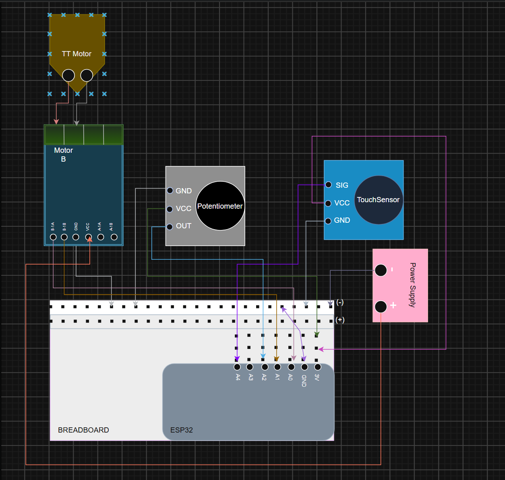
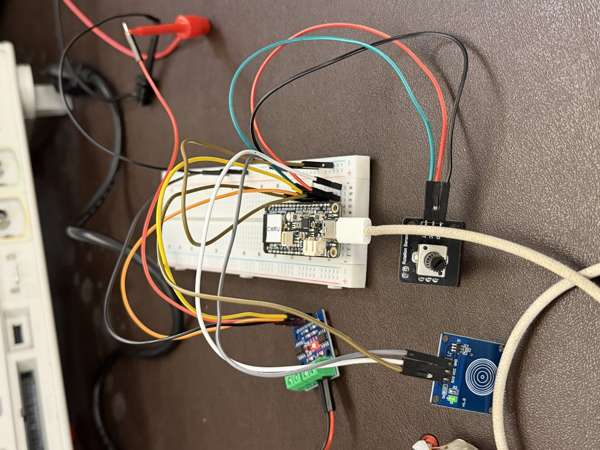
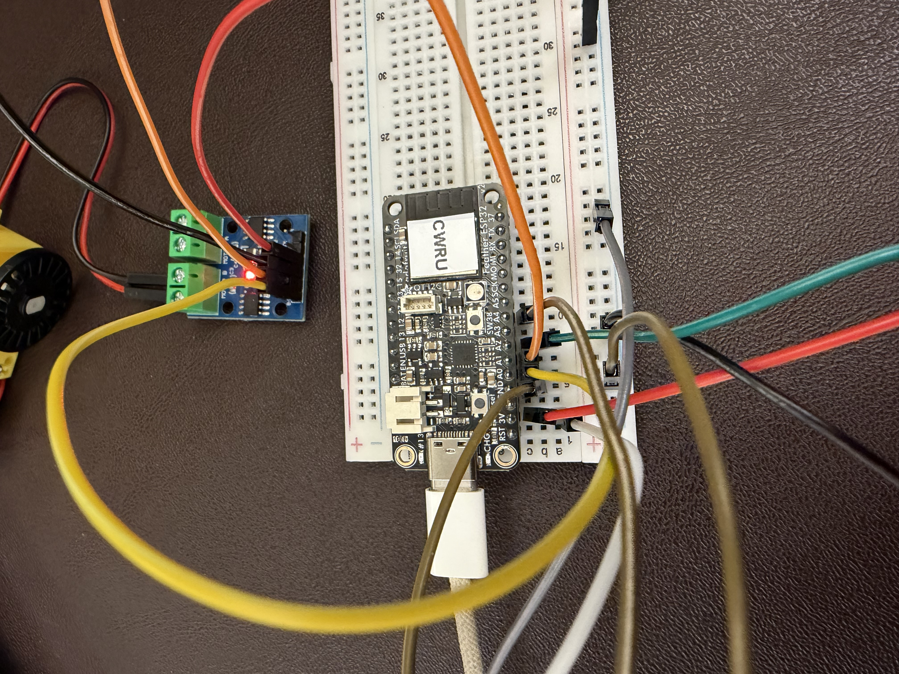

George Guaman
## ECSE 395 - Integration Exploration

This is my fourth assignment working with the ESP32. The goal of this lab is to learn how to integrate sensors and actuators together using the ESP32. In this lab, I worked with a potentiometer, a touch sensor, and a TT motor. I tested how the sensors could provide information to the ESP32 and how that information could then be used to control the TT motor.
## Steps I took
1. I created a new markdown file _integration exploration.md_ and updated it throughout the lab.
2. I opened the Lab 5 from my ECSE 395 GitHub repository in PlatformIO using VS Code on Windows to build and upload code to the ESP32 using a USB-C cable.
3. I used the ESP32, potentiometer, touch sensor, TT motor, motor driver, breadboard, jumper wires, and power supply to complete the lab.
4. I then create the circuit shown in Figure 1.
5. I limited the power supply to 3V and 0.15A
6. I then coded, built, and uploaded _main.cpp_ to the ESP32 and began combining the potentiometer, touch sensor, and TT motor into one system.
7. I included outputs for the touch and potentiometer to the Serial Monitor in order to debug and verify the system was working as intended
8. I used the potentiometer to determine the position of the system and converted its analog reading into an approximate angle from 0-90 degrees.
9. I programmed the system to detect when the potentiometer moved past an active angle and use this to activate the system.
10. I added a timer so that the system would wait for a set amount of time after the potentiometer stopped moving before activating the TT motor.
11. I used the touch sensor to determine which target angle the TT motor should move toward.
12. I used the potentiometer as feedback while the TT motor was running so the motor could stop once the target angle was reached
13. I tested the system multiple times to ensure it operated correctly and verifies them using the Serial Monitor to view the potentiometer and touch sensor readings.
14. I recorded pictures of the circuit and a video showing the sensor and actuator working together.
15. I documented my observations, testing, and reflection in _integration exploration.md_.
16. I then pushed and committed all of these changes to GitHub.

All of the files for this lab are located in the Lab 5 folder of my ECSE 395 GitHub repository. These include:
- _**main.cpp**_ - Contains the code that reads the potentiometer and touch sensor and controls the TT motor.
- _**integration exploration.md**_ - Contains my lab documentation, observations, setup and procedure information, pictures, schematic, video, and reflection.

### How the System Works
The basic behavior of the system was that:

**Potentiometer detects movement → System becomes active after movement position valid→ Wait for movement to stop → Checks touch sensor → Selects target angle accordingly→ Activates TT motor after wait time is over → Potentiometer reaches target → Motor stops and system resets**

The potentiometer is used as the main position sensor for the system. The ESP32 reads its analog value and converts the value into an approximate angle from 0-90 degrees. When the potentiometer moves past the assigned active angle, the system becomes active. The ESP32 then monitors the potentiometer to determine when movement has stopped. Then, after the system has gone through the selected amount of time, the ESP32 reads the touch sensor. Depending on the touch sensor reading, the program selects one of two target angles. The TT motor then turns on and moves the system toward the selected target angle. While the motor is moving, the potentiometer continues to provide feedback to the ESP32. Once the potentiometer reaches the target angle, the motor turns off. This allows the sensor information to control the actuator instead of having the motor run for a fixed amount of time. 

I modeled this after my project. So another brief explanation of the system in terms of toilet is that the sensor monitors if a toilet is opened with the seat and lid or just the lid. This is necessary as different closing mechanisms are required for each one due to different weights between them. If the touch sensor detects only the lid was lifted, a lower angle is needed due to less weight and if both were open then the opposite. The potentiometer detects an opening of any kind and tracks it's position for the closing. The motor is the mechanism closing the lid. But one small thing in the code that changes is the logic of how to read the sensor angle and which assignment of target angle to give the system. I found that if you held the touch sensor at contact and then read it again using another digitalRead, it would flip the value, so if it was reading 1, and then I tries to read it again using a different digitalRead in a nested loop, the new digitalRead would show 0. So I changed these till it matches the behavior I described.
### Proof of Sensors-Actuator Integration (Extra Credit)
#### Circuit Schematic:

#### Pictures of Setup:

#### Video of Sensor-Actuator Integration:

## Reflection

1. It took me around 2 hours to complete this assignment. Most of the time was spent debugging the code so the touch sensor behaved I wanted it to
2. I would say the difficulty of this assignment was easy because I was comfortable working with the individual components I have used before
3. I feel more comfortable working with the ESP32 
4. No additional feedback